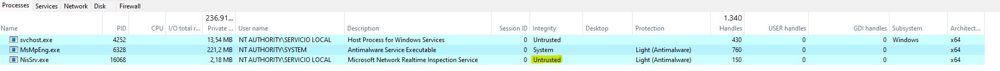

# SanboxIt
This PoC sets Untrusted Integrity to an specific process using highest possible privileges.
Use: SandboxIt.exe PID

# Credits
* https://www.elastic.co/es/security-labs/sandboxing-antimalware-products